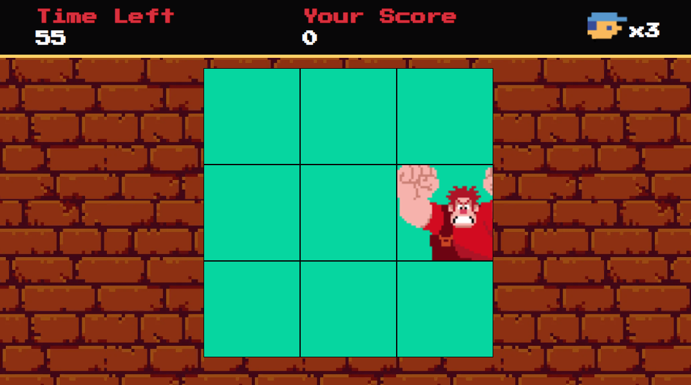
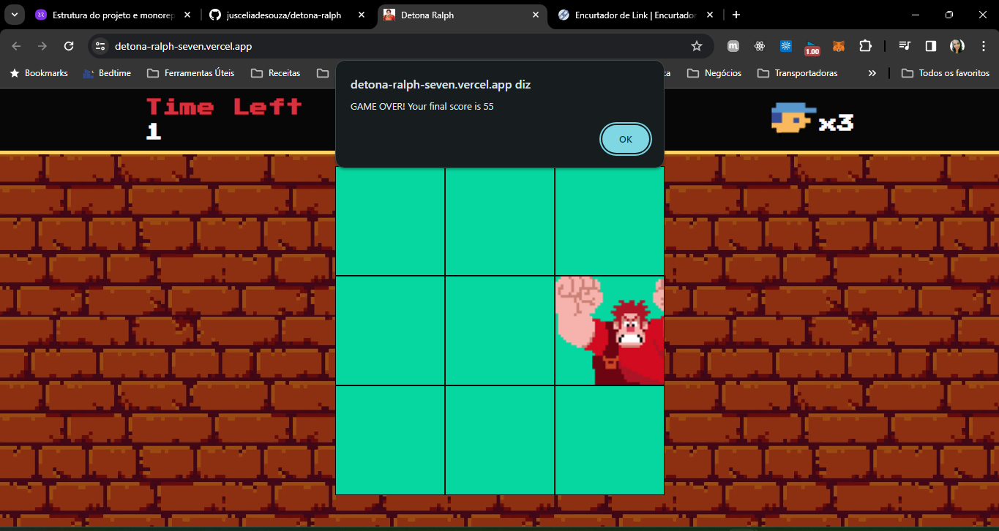

  
  <h1>Detona Ralph - Arcade Game</h1>

<!--  -->

<!-- 

  

 -->

Bem-vindo ao **Detona Ralph**, um emocionante jogo de arcade onde você assume o controle de Ralph, o destemido herói em uma missão cheia de ação! Desenvolvido em **HTML**, **CSS** e **JavaScript**, este jogo traz uma experiência clássica de **"whack-a-mole"** com um toque moderno.

## 🎮 Como Jogar

🕹️ **Controles Simples**: Utilize o mouse para acertar os inimigos que surgem nos quadrados. Cada acerto aumenta sua pontuação.

⏰ **Tempo Limitado:** O tempo está passando! Mantenha-se ágil e acerte o máximo de inimigos possível antes que o tempo acabe.

❤️ **Vidas Limitadas:** Você começa com 3 vidas. Cada vez que você deixa um inimigo escapar, perde uma vida. Quando suas vidas se esgotam, o jogo termina.

## 📸 Capturas de Tela

📸 **[ Screenshot01 ]:** Tela do jogo em execução.

📸 [Screenshot 2]: Tela de Game Over, que mostra o score final do jogador.

## 💻 Recursos Técnicos

💻 **HTML, CSS, e JavaScript:** Desenvolvido utilizando tecnologias web padrão para uma experiência acessível e fácil de compartilhar.

🔊 **Efeitos Sonoros:** Desfrute de efeitos sonoros imersivos para cada acerto, tornando a jogabilidade ainda mais envolvente.

## 🚀 Como Iniciar

### 📋 Pré-requisitos

Antes de começar, você precisará ter as seguintes ferramentas instaladas em sua máquina:

- [Git](https://git-scm.com)
- [Node.js](https://nodejs.org/en/)
- [NPM](https://www.npmjs.com/) ou [Yarn](https://yarnpkg.com/) ou [PNPM](https://pnpm.js.org/)
- [Live Server](https://marketplace.visualstudio.com/items?itemName=ritwickdey.LiveServer)

Além disso, é bom ter um editor para trabalhar com o código, como [VSCode](https://code.visualstudio.com/). No entanto, não é obrigatório. Você pode usar o editor de sua preferência 😉.

Para executar o jogo, você precisará de um navegador moderno, como [Chrome](https://www.google.com/intl/pt-BR/chrome/) ou [Firefox](https://www.mozilla.org/pt-BR/firefox/new/). 

> O jogo não é compatível com o Internet Explorer.

### 🎲 Rodando o Jogo

#### 🖥️ Executando o Jogo Localmente

1. Abra o projeto no VSCode.

2. Instale a extensão [Live Server](https://marketplace.visualstudio.com/items?itemName=ritwickdey.LiveServer).

3. Clique com o botão direito no arquivo [**index.html**](./index.html) e selecione a opção **Open with Live Server**.

4. Comece a jogar e veja quanto tempo você consegue manter sua pontuação!

#### 🖥️ Executando o Jogo pelo Deploy

1. Acesse o link do por [aqui](https://l1nq.com/bora-jogar-detona-ralph).

2. Comece a jogar e veja quanto tempo você consegue manter sua pontuação!

## 🤝 Contribuições

Gostaríamos de receber suas contribuições para tornar o Detona Ralph ainda melhor! Consulte o arquivo [**CONTRIBUTING.md**](./docs/CONTRIBUTING.md) para saber como contribuir.

## 📝 Licença

Este projeto é licenciado sob os termos da Licença **MIT**. Consulte o arquivo [LICENSE](./docs/LICENSE) para obter mais detalhes.

## 🎉 Agradecimentos

Obrigada por jogar o Detona Ralph! Divirta-se detonando inimigos e mostrando suas habilidades gamer! 😎🎮
